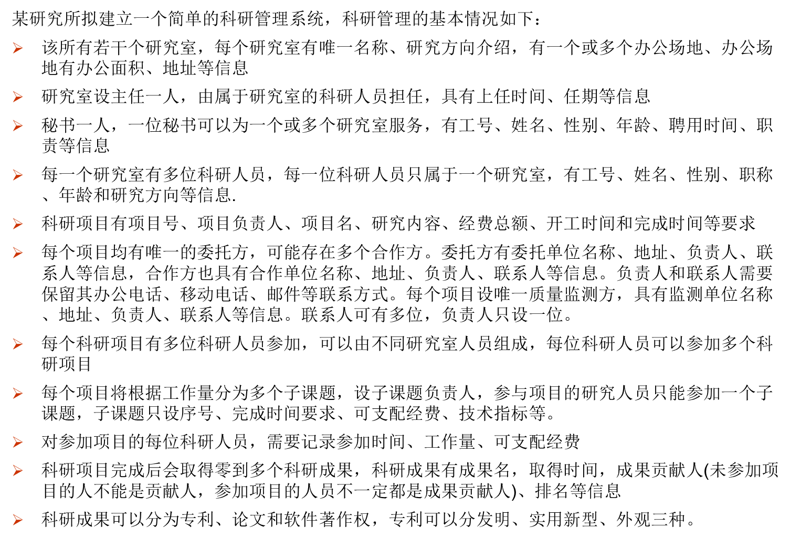
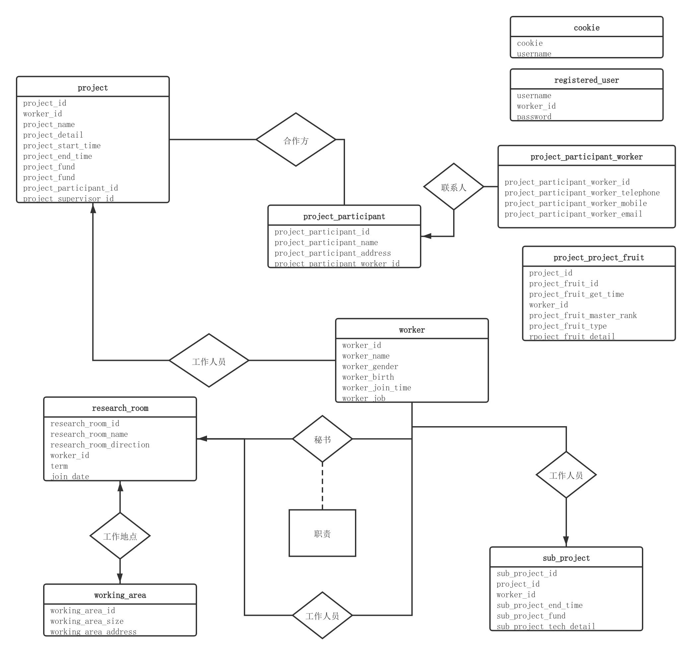

# 科研项目管理系统

## 项目简介

这是一个数据库的课程设计，要求如下图

## 项目 ER 图

## 项目包结构

apiHandler: 所有 Http 映射的处理函数

databaseAccess: 数据库抽象访问接口

dataUtil: 数据库访问接口的实现

doc: 项目文档

html: 前端页面

jsonHelper: 生成 json 字符串的工具

## 项目运行

1. 使用`go run main.go`运行项目

   可以在指定端口看到前端页面

2. 可以使用 docker 运行项目

## 数据库表设计

1. research_room 研究室

   research_room_id : 研究室 ID

   research_room_name : 研究室名

   research_room_direction : 研究室方向

2. working_area 办公场地

   working_area_id : 办公场地 ID

   working_area_size : 办公场地大小

   working_area_address : 办公场地地址

3. research_room_working_area 研究室与办公场地

   research_room_id : 研究室 ID

   working_area_id : 办公场地 ID

4. worker 员工

   worker_id : 员工 ID

   worker_name : 员工名

   worker_gender : 员工性别

   worker_birth : 员工生日

   worker_join_time : 员工入职时间

   worker_job : 工作（职称）

5. research_room_boss 研究室与主任

   research_room_id : 研究室 ID

   worker_id : 员工 ID

   join_time : 上任时间

   term : 任期

6. research_room_sectary 研究室与秘书

   research_room_id : 研究室 ID

   worker_id : 员工 ID

   job_detail : 职责

7. research_room_worker 研究室与员工

   research_room_id : 研究室 ID

   worker_id : 员工 ID

   direction : 研究方向

8. project 科研项目

   project_id : 项目 ID

   worker_id : 负责人 ID

   project_name : 项目名

   project_detail : 项目内容

   project_start_time : 项目开始时间

   project_end_time : 项目结束时间

   project_fund : 项目经费

   project_participant_id : 项目需求方 ID

9. project_participant 项目参与方（委托、合作、监测）

   project_participant_id : 项目参与方 ID

   project_participant_name : 项目参与方名

   project_participant_address : 项目参与方地址

   project_participant_worker_id : 项目参与方负责人

10. project_participant_worker 项目参与方工作人员（负责人、联系人）

    project_participant_worker_id : 项目参与方工作人员 ID

    project_participant_worker_telephone : 项目参与方工作人员办公电话

    project_participant_worker_mobile : 项目参与方工作人员移动电话

    project_participant_worker_email : 项目参与方工作人员电子邮箱

11. project_participant_project_participant_worker_contact 三方联系人表

    project_participant_id : 项目参与方 ID

    project_participant_worker_id : 项目参与方工作人员 ID

12. project_worker 科研项目人员

    project_id : 项目 ID

    worker_id : 员工 ID

13. sub_project 子课题

    sub_project_id : 子课题 ID

    project_id : 项目 ID

    worker_id : 负责人

    sub_project_end_time : 子课题结束时间

    sub_project_fund : 子课题经费

    sub_project_tech_detail : 子课题技术指标

14. sub_project_worker 子课题员工表

    sub_project_id : 子课题 ID

    worker_id : 员工 ID

    join_time : 加入时间

    sub_project_worker_fund : 可支配经费

    workload : 工作量

worker_id 要求必须是子课题的科研项目参与人，即在表 project_worker 中有记录

worker_id 要求不能重复（不可参加多个子项目）

15. project_project_fruit 科研项目成果

    project_id : 项目 ID

    project_fruit_id : 项目成果 ID

    project_fruit_name : 项目成果名

    project_fruit_get_time : 项目成果获得时间

    worker_id : 项目成果贡献人 ID

    project_fruit_master_rank : 项目成果排名

worker_id 要求必须是子课题的科研项目参与人，即在表 project_worker 中有记录

16. project_fruit 项目成果

    project_fruit_id : 项目成果 ID

    project_fruit_type : 项目成果类型

    project_fruit_detail : 项目成果内容

## MySQL 建表语句

可以查看 [DB.sql](DB.sql)
